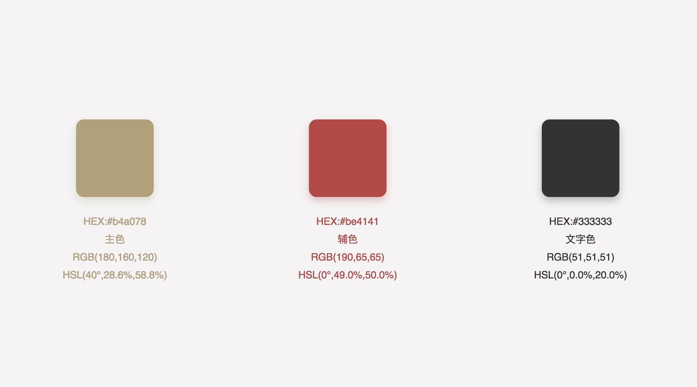

# 关于 CSS

在 MDN 中 [CSS](https://developer.mozilla.org/zh-CN/docs/Web/CSS) 的定义：

> 
层叠样式表 (Cascading Style Sheets，缩写为 CSS），是一种样式表语言，用来描述 HTML 或 XML（包括如 SVG、XHTML 之类的 XML 分支语言）文档的呈现。
CSS 描述了在屏幕、纸质、音频等其它媒体上的元素应该如何被渲染的问题。


通俗的 CSS 定义：

> 一门给予用户视觉上愉悦的“语言”，一门值得web开发者不断探索的语言。

## 原则

书写顺序

```css
/* 遵照一定的顺序规则 */
1.位置属性(position, top, right, z-index, display, float等)
2.大小(width, height, padding, margin)
3.文字系列(font, line-height, letter-spacing, color, text-align等)
4.背景(background, border等)
5.其他(animation, transition等)
```

减少重复代码

```css
/* bad~bad~bad~ */
tips {
    color: #f4f0ea;
    border: 1px solid #f4f0ea;
}
tips:before {
    border-left-color: #f4f0ea;
}

/* good~good~good~ */
tips {
    color: #f4f0ea;
    border: 1px solid currentColor;
}
tips:before {
    border-left-color: inherit;
}
```

合理使用简写

```css
/* bad~bad~bad~ */
div {
    border-width: 10px 5px 10px 5px;
}

/* good~good~good~ */
div {
    border-width: 10px 5px; 
}
```

适当的过渡效果

```css
/* bad~bad~bad~ */
input:not(:focus) + .popTips{
    display: none;
}
input:focus + .popTips{
    display: block;
}

/* good~good~good~ */
input:not(:focus) + .popTips{
    transform: scale(0);
    transition: transform .25s cubic-bezier(.25, .1, .25, .1);
}
input:focus + .popTips{
    transform: scale(1);
    transition: transform .4s cubic-bezier(.29, .15, .5, 1.46);
}
```

## 色彩

为了保持文档中示例的一致性，文档中所有示例配色均参考使用 [网易严选](http://you.163.com/) 设计规范。



