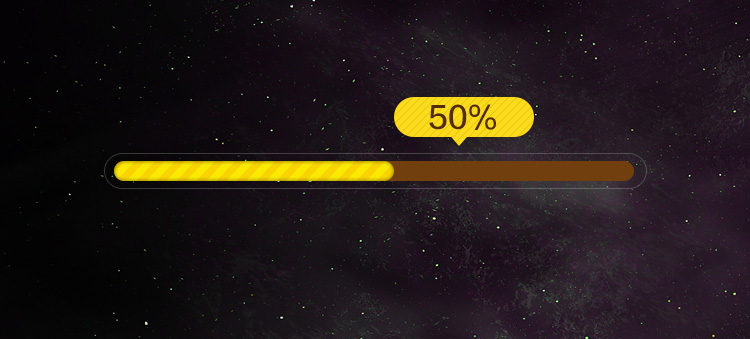
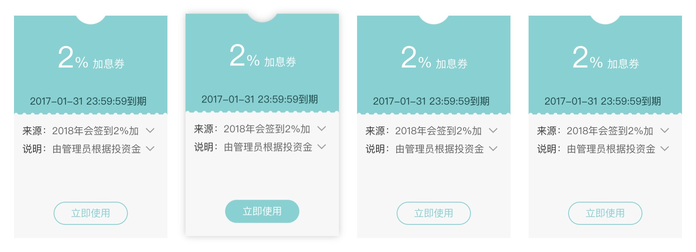

# 条纹背景

> 背景知识: [gradient](https://developer.mozilla.org/zh-CN/docs/Web/CSS/gradient), [linear-gradient](https://developer.mozilla.org/zh-CN/docs/Web/CSS/linear-gradient), [radial-gradient](https://developer.mozilla.org/zh-CN/docs/Web/CSS/radial-gradient), [repeating-linear-gradient](https://developer.mozilla.org/zh-CN/docs/Web/CSS/repeating-linear-gradient)

线性渐变`linear-gradient`是CSS3非常重要的一个模块，但在真实的开发中，我们并不常用，在这里，我举两个自己经常会用到的场景，分别是`进度条`和`不规则卡片`。

## 进度条

  

    

      

    

  

## 不规则卡片

>卡片顶部凹进来的弧形我们可以通过径向渐变`radial-gradient`来实现

  

### 浏览器支持

<iframe src="https://caniuse.bitsofco.de/embed/index.html?feat=css-gradients&amp;periods=future_1,current,past_1,past_2,past_3&amp;accessible-colours=false" frameborder="0" width="100%" height="436px"></iframe>